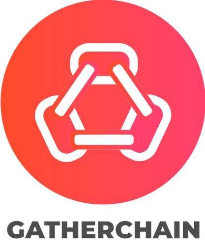

<!--
*** Thanks for checking out the Best-README-Template. If you have a suggestion
*** that would make this better, please fork the repo and create a pull request
*** or simply open an issue with the tag "enhancement".
*** Thanks again! Now go create something AMAZING! :D
-->


<!-- PROJECT SHIELDS -->
<!--
*** I'm using markdown "reference style" links for readability.
*** Reference links are enclosed in brackets [ ] instead of parentheses ( ).
*** See the bottom of this document for the declaration of the reference variables
*** for contributors-url, forks-url, etc. This is an optional, concise syntax you may use.
*** https://www.markdownguide.org/basic-syntax/#reference-style-links
-->
[![Contributors][contributors-shield]][contributors-url]
[![Forks][forks-shield]][forks-url]
[![Stargazers][stars-shield]][stars-url]
[![Issues][issues-shield]][issues-url]
[![MIT License][license-shield]][license-url]
[![LinkedIn][linkedin-shield]][linkedin-url]


<!-- PROJECT LOGO -->
<br />
<p align="center">
  <a href="https://github.com/Jalmeida1994/GatherChain-DesktopClient">
    
  </a>

  <h3 align="center">GatherChain Desktop App</h3>

  <p align="center">
    Desktop client made for the GatherChain solution.
    <br />
    <a href="https://github.com/Jalmeida1994/GatherChain-DesktopClient/blob/master/README.md"><strong>Explore the docs »</strong></a>
    <br />
    <br />
    <a href="https://github.com/Jalmeida1994/GatherChain-DesktopClient/issues">Report Bug</a>
    ·
    <a href="https://github.com/Jalmeida1994/GatherChain-DesktopClient/issues">Request Feature</a>
  </p>
</p>


<!-- TABLE OF CONTENTS -->
<details open="open">
  <summary>Table of Contents</summary>
  <ol>
    <li>
      <a href="#about-the-project">About The Project</a>
      <ul>
        <li><a href="#built-with">Built With</a></li>
      </ul>
    </li>
    <li>
      <a href="#getting-started">Getting Started</a>
      <ul>
        <li><a href="#prerequisites">Prerequisites</a></li>
        <li><a href="#installation">Installation</a></li>
      </ul>
    </li>
    <li><a href="#usage">Usage</a></li>
    <li><a href="#roadmap">Roadmap</a></li>
    <li><a href="#contributing">Contributing</a></li>
    <li><a href="#license">License</a></li>
    <li><a href="#contact">Contact</a></li>
    <li><a href="#acknowledgements">Acknowledgements</a></li>
  </ol>
</details>


<!-- ABOUT THE PROJECT -->
## About The Project

[![Product Name Screen Shot][product-screenshot]](images/arm-template.png)

GatherChain is the solution created for my Master Thesis: __Tracing Responsibility in Evolution of Model's Life Cycle in Collaborative Projects in Education__.
In the paper, it is proposed a blockchain-based solution for version control of model-driven engineering artefacts.  The goal is to facilitate collaboration in a multi-user area,like the education field, and track changes in a trusted and secure manner. This solution is based on using the Hyperledger Fabric Network to govern and regulate file version control functions among students and teachers.
This repository is a part of the larger GatherChain solution.

The other GatherChain projects are:
* __GatherChain ARM Template__: https://github.com/Jalmeida1994/GatherChain-ARM-Template
* __GatherChain Web Server__: https://github.com/Jalmeida1994/GatherChain-Web-Server
* __GatherChain Blockchain Server__: https://github.com/Jalmeida1994/GatherChain-BlockChain-Server
* __GatherChain Admin Commands__: https://github.com/Jalmeida1994/GatherChain-AdminCommands

This repository serves as the desktop interface for the solution. Made to be used by the users of the system.

### Built With

* [Electron](https://www.electronjs.org)
* [Shell Scripts](https://www.shellscript.sh)
    * [GNU Bash](https://www.gnu.org/software/bash/)


<!-- GETTING STARTED -->
## Getting Started

In this section it'll be shown how to get started with this solution. It is fixed the Azure cloud as the cloud environment for the solution. All the commands were tested with Azure.
### Prerequisites

* [Azure Subscription](https://docs.microsoft.com/en-us/azure/cost-management-billing/manage/create-subscription)
* [Azure CLI](https://docs.microsoft.com/en-us/cli/azure/install-azure-cli)

### Installation

1. Clone the repo
   ```
   git clone https://github.com/Jalmeida1994/GatherChain-DesktopClient.git
   ```
2. Change the parameters in [azuredeploy.parameters.json](https://github.com/Jalmeida1994/GatherChain-DesktopClient/blob/master/azuredeploy.parameters.json) to your needs;

4. Login to Azure in `az` if not logged yet
   ```
   az login
   ```
5. Create the resource group (list of locations available with `az account list-locations -o table`)
   ```
   az group create --name ${resourcegroup_name} --location ${location}
   ```
6. Deploy ARM template to the previously created resource group
   ```
    az deployment group create --resource-group ${resourcegroup_name} --template-file azuredeploy.json --parameters azuredeploy.parameters.json
   ```
   

<!-- USAGE EXAMPLES -->
## Usage

After the template is deployed to your cloud provider of choice or on premises infraestructure, you should start the blockchain network using the admin commands found in the [GatherChain Admin Commands](https://github.com/Jalmeida1994/GatherChain-AdminCommands).

_For more information, please refer to the [Documentation](https://github.com/Jalmeida1994/GatherChain-AdminCommands/blob/master/README.md)_


<!-- USAGE EXAMPLES -->
### Cleanup

To delete all the resources created use the `az group delete` command
   ```
    az group delete --name ${resourcegroup_name} -y
   ```


<!-- ROADMAP -->
## Roadmap

See the [open issues](https://github.com/Jalmeida1994/GatherChain-DesktopClient/issues) for a list of proposed features (and known issues).


<!-- CONTRIBUTING -->
## Contributing

Contributions are what make the open source community such an amazing place to be learn, inspire, and create. Any contributions you make are **greatly appreciated**.

1. Fork the Project
2. Create your Feature Branch (`git checkout -b feature/AmazingFeature`)
3. Commit your Changes (`git commit -m 'Add some AmazingFeature'`)
4. Push to the Branch (`git push origin feature/AmazingFeature`)
5. Open a Pull Request


<!-- LICENSE -->
## License

Distributed under the MIT License. See `LICENSE` for more information.


<!-- CONTACT -->
## Contact

João Almeida - [@João Almeida](https://www.linkedin.com/in/jo%C3%A3o-almeida-525476125/) - jcfd.almeida@campus.fct.unl.pt

Project Link: [https://github.com/Jalmeida1994/GatherChain-DesktopClient](https://github.com/Jalmeida1994/GatherChain-DesktopClient)


<!-- ACKNOWLEDGEMENTS -->
## Acknowledgements
* [FCT-UNL](https://www.fct.unl.pt/)
* [Professor Vasco Amaral](https://docentes.fct.unl.pt/vma/)


<!-- MARKDOWN LINKS & IMAGES -->
<!-- https://www.markdownguide.org/basic-syntax/#reference-style-links -->
[contributors-shield]: https://img.shields.io/github/contributors/Jalmeida1994/GatherChain-DesktopClient.svg?style=for-the-badge
[contributors-url]: https://github.com/Jalmeida1994/GatherChain-DesktopClient/graphs/contributors
[forks-shield]: https://img.shields.io/github/forks/Jalmeida1994/GatherChain-DesktopClient.svg?style=for-the-badge
[forks-url]: https://github.com/Jalmeida1994/GatherChain-DesktopClient/network/members
[stars-shield]: https://img.shields.io/github/stars/Jalmeida1994/GatherChain-DesktopClient.svg?style=for-the-badge
[stars-url]: https://github.com/Jalmeida1994/GatherChain-DesktopClient/stargazers
[issues-shield]: https://img.shields.io/github/issues/Jalmeida1994/GatherChain-DesktopClient.svg?style=for-the-badge
[issues-url]: https://github.com/Jalmeida1994/GatherChain-DesktopClient/issues
[license-shield]: https://img.shields.io/github/license/Jalmeida1994/GatherChain-DesktopClient.svg?style=for-the-badge
[license-url]: https://github.com/Jalmeida1994/GatherChain-DesktopClient/blob/master/LICENSE.txt
[linkedin-shield]: https://img.shields.io/badge/-LinkedIn-black.svg?style=for-the-badge&logo=linkedin&colorB=555
[linkedin-url]: https://www.linkedin.com/in/jo%C3%A3o-almeida-525476125/
[product-screenshot]: images/arm-template.png
